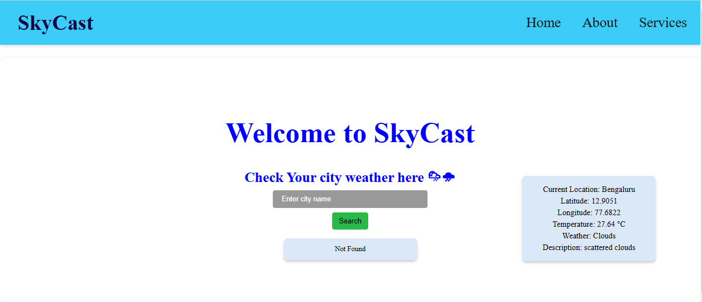
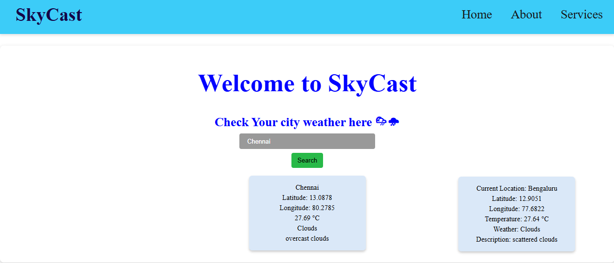
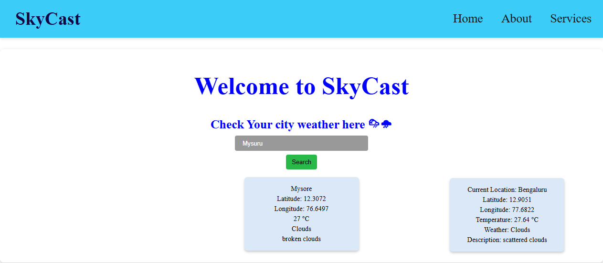

# React + Vite

This template provides a minimal setup to get React working in Vite with HMR and some ESLint rules.

Currently, two official plugins are available:

- [@vitejs/plugin-react](https://github.com/vitejs/vite-plugin-react/blob/main/packages/plugin-react/README.md) uses [Babel](https://babeljs.io/) for Fast Refresh
- [@vitejs/plugin-react-swc](https://github.com/vitejs/vite-plugin-react-swc) uses [SWC](https://swc.rs/) for Fast Refresh

   SkyCast -Weather App

  
  SkyCast is a weather application built with React + Vite. It allows users to check the current weather of their location and search for weather updates of any city worldwide.

🌟 Features

   Fetch current weather based on geolocation
  
   Search for any city’s weather
  
   Display temperature, weather conditions, and coordinates
  

   
 

  

